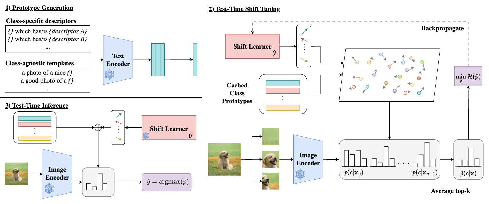

# *Just Shift It*: Test-Time Prototype Shifting for Zero-Shot Generalization with Vision-Language Models

[](https://lbesson.mit-license.org/)
[](https://www.python.org/downloads/release/python-3918/)
[](https://pytorch.org/get-started/previous-versions/#v21)

This repo provides the PyTorch source code of our paper: 
[*Just Shift It*: Test-Time Prototype Shifting for Zero-Shot Generalization with Vision-Language Models](https://arxiv.org/abs/2403.12952)

## Abstract

Advancements in vision-language models (VLMs) have propelled the field of computer vision, particularly in the zero-shot learning setting. Despite their promise, the effectiveness of these models often diminishes due to domain shifts in test environments. To address this, we introduce the **Test-Time Prototype Shifting** (**TPS**) framework, a pioneering approach designed to adapt VLMs to test datasets using unlabeled test inputs. Our method is based on the notion of modulating per-class prototypes in the shared embedding space. By pre-computing and caching prototypes generated with the pre-trained text encoder, TPS not only facilitates optimization-free prototype reuse for subsequent predictions but also enables seamless integration with current advancements in prompt engineering. At test-time, TPS dynamically learns shift vectors for each prototype based solely on the given test sample, effectively bridging the domain gap and enhancing classification accuracy. A notable aspect of our framework is its significantly reduced memory and computational demands when compared to conventional text-prompt tuning methods. Extensive evaluations across 15 datasets involving natural distribution shifts and cross-dataset generalization demonstrate TPS's superior performance, achieving state-of-the-art results while reducing resource requirements.

## Approach
<p align = "center">
  
</p>

**Figure: Overview of our approach, ***TPS***.** We illustrate the three stages of **Test-Time Prototype Shifting (TPS)**. **1) Prototype Generation:** pre-computation of class prototypes using different prompt-engineering strategies. We show the computation of $k$ class-conditioned descriptors for a single class. Means are computed and cached. **2) Test-Time Shift Tuning:** one iteration of test-time training where we tune the Shift Learner to generate small perturbations to the class prototypes to close the gap between the source and target distributions. Marginal entropy of the CLIP similarities of the shifted prototypes and augmented image embeddings is minimized. **3) Test-Time Inference:** Using the tuned Shift Learner, we compute the final prediction for the shifted class prototypes and the original image embedding with CLIP similarity.

## Getting Started

This codebase is built on [TPT](https://github.com/azshue/TPT). Please refer to it for setup and dataset download.

### Computing prototype embeddings

To save vanilla prototype embeddings, run
```
python3 utils/save_class_embeds.py \
    --arch $ARCH
```

We provide our GPT-4-generated descriptors in `gpt4_descriptors` in JSON format.
To save descriptor embeddings, run
```
python3 utils/save_concepts.py \
    --concepts_json $json_path \
    --dataset $dataset \
    --arch $ARCH
```

Please refer to the code itself to generate variants of augmented prototypes. 

### Running TPS

Scripts to run TPS and various baselines are available in the `scripts` folder. An example to run TPS with augmented prototypes:
```
bash ./scripts/shift/shift_text_per_class_mean_init_template_and_gpt4_micro.sh I/A/V/R/K 5e-3 1234
```

Similar to TPT, the test sets are separated by `/` and we use the short-forms denoted in `data/datautils.py`.


## Citation

If you use this repo in your research, please cite it as follows:

```
@misc{sui2024tps,
      title={Just Shift It: Test-Time Prototype Shifting for Zero-Shot Generalization with Vision-Language Models}, 
      author={Elaine Sui and Xiaohan Wang and Serena Yeung-Levy},
      year={2024},
      eprint={2403.12952},
      archivePrefix={arXiv},
      primaryClass={cs.CV}
}
```